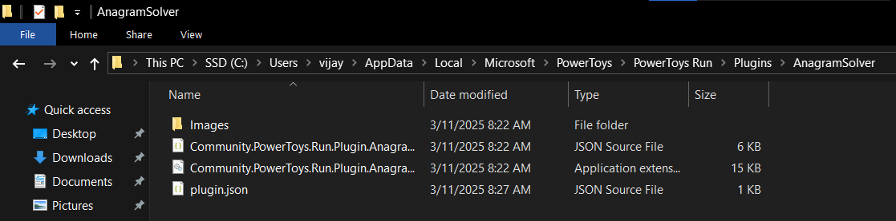
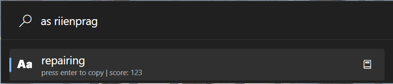

# tubeToys
A PowerToys plugin to directly search on youtube.

## Installation
1. Download the latest release from the [releases page](https://github.com/vijayv996/AnagramSolver/releases).
2. Extract the `.zip` file's contents to `%LocalAppData%\Microsoft\PowerToys\PowerToys Run\Plugins`
##### Structure

3. Restart PowerToys.

## Usage & screenshots
- Open PowerToys Run.
- Type 'as' and paste scrambled word

- Hit enter to copy the word to your clipboard.
- Press ctrl + D to open the definition in your default browser.

## Credits
- [datamuse api](https://www.datamuse.com/api/)
- [8LWXpg](https://github.com/8LWXpg) for this amazing [template](https://github.com/8LWXpg/PowerToysRun-PluginTemplate).